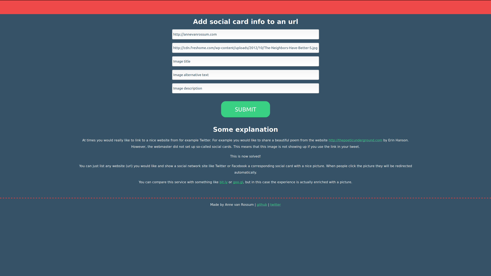

# Picktwt

A utility that shows a picture in a social media card even if the original website does not have social media card information embedded. It does this as an URL redirector. The end-user will be redirected to the original website. The twitter or facebook bot will instead see the intermediate website with the social card information and won't follow the redirect.

# Website

Functionality can be found at <https://picktwt.herokuapp.com/>. Add a website, add a picture (should be online) and create a social card.

You can validate the card (so you don't need to post at social media):

* for Twitter at <https://cards-dev.twitter.com/validator>;
* for Facebook at <https://developers.facebook.com/tools/debug/>.

Of course, you can also just immediately use the link on your Facebook page or Twitter feed.

# Disclaimer

This function is not against any of the guidelines of those companies (that I know of). However, you never know. Do not rely on picture perfect (or any) delivery. There are no guarantees provided of any kind.

# Copyrights

All copyrights:

* Author: Anne van Rossum
* License: LGPLv3+, Apache License 2.0, and/or MIT (triple-licensed)
* Copyrights: Anne van Rossum
* Creation date: October 7th., 2017
